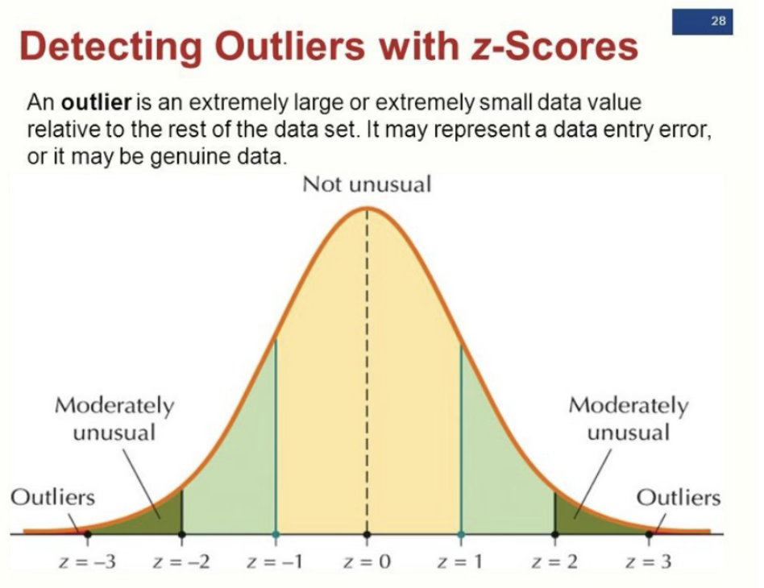

Z-score : 관측치가 평균에서 벗어난 표준 편차의 수를 나타냄. 포인트 그룹의 평균 및 표준 편차와의 관계 측면에서 데이터 포인트를 설명하는 방법이라고 볼 수 있다. 

Z score 기반 anomaly detection은 정상(In-Domain) 데이터가 정규분포(가우시안 분포)를 따른다고 가정하는 것입니다. 수집된 정상 데이터들의 평균과 표준편차를 구한 뒤, 새로운 데이터가 들어왔을 때 이 데이터가 평균으로부터 표준편차의 몇 배만큼 떨어져 있는지를 계산합니다.

- 데이터 포인트의 68%는 +/-1 표준 편차 사이에 있다.
- 데이터 포인트의 95%가 +/-2 표준 편차 사이에 있다.
- 데이터 포인트의 99.7%가 +/-3 표준 편차 사이에 있다.

여기서 일반적으로 이상값을 z 점수의 계수가 임계값보다 큰 것으로 정의하는데, 이 임계값은 일반적으로 2보다 크고, 3은 공통값으로 본다. 데이터 포인트의 z 점수가 3보다 크면 데이터 포인트가 다른 데이터 포인트와 상당히 다르다는 것을 나타내게 되는데, 이러한 데이터 포인트를 이상값으로 정의한다.

한계 및 주의점
정규성 가정: 데이터가 정규분포를 따르지 않는다면(예: 비대칭 분포, 다봉 분포) 신뢰도가 크게 떨어집니다.
차원의 저주: 단일 변수(1차원)에는 훌륭하지만, 딥러닝 모델의 임베딩 벡터처럼 고차원 데이터에 변수별로 단순 적용하기에는 무리가 있습니다.
이상치에 민감함: 초기에 mu와 sigma를 계산할 때 훈련 데이터 자체에 이미 극단적인 이상치가 포함되어 있다면, 임계값의 기준 자체가 흔들리게 됩니다(Masking Effect).

Logit / Confidence Score 적용: 모델이 예측한 최종 확률값(Softmax 직전의 Logit 등)의 분포를 모아 평균과 표준편차를 구하고, 새로운 질문이 들어왔을 때 확신도가 Z-Score 임계값을 벗어날 정도로 지나치게 낮거나 높으면 노이즈(OOD)로 걸러냅니다.

고차원 공간으로의 확장 (Mahalanobis Distance): 단순 Z-Score는 1차원용이므로, 고차원 임베딩 공간에서는 Z-Score의 다차원 확장판 격인 마할라노비스 거리(Mahalanobis Distance)를 주로 사용합니다. 변수 간의 상관관계(공분산)까지 고려하여 다차원 임베딩 상에서 OOD를 훨씬 정교하게 판별할 수 있습니다.